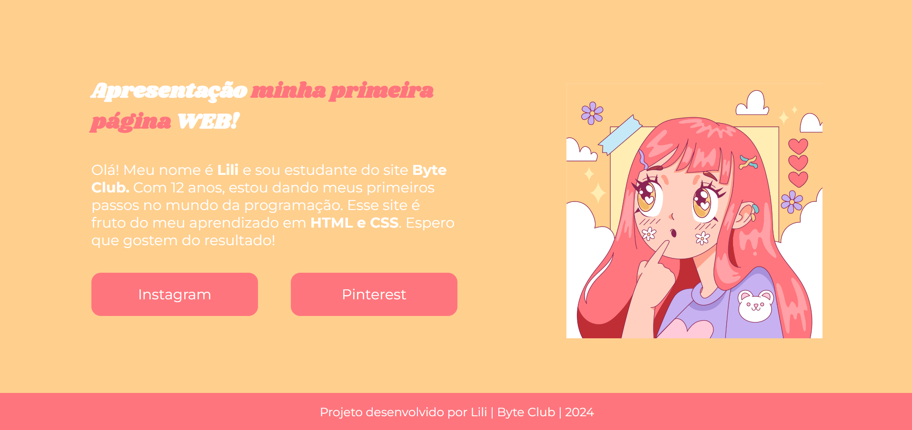

## Projeto site pessoal Byte Club

Este repositório contém o código fonte do meu site pessoal, criado durante meu aprendizado em HTML e CSS no Byte Club. 

**Objetivo:** 
Criar um site simples para me apresentar e compartilhar meus links sociais.

**Tecnologias Utilizadas:**

- **HTML (HyperText Markup Language):**  Linguagem de marcação utilizada para estrutura da página.
- **CSS (Cascading Style Sheets):** Linguagem de estilo utilizada para definir a aparência da página, como cores, fontes e layout. 

**Estrutura:**

- `index.html`:  Arquivo principal que contém o conteúdo da página web. 
- `style.css`:  Arquivo de estilo que define a aparência visual da página.

**Como visualizar o projeto:**

1. Clone este repositório.
2. Abra o arquivo `index.html` em seu navegador web.

**Recursos:**

- Imagens: O arquivo `img.png` foi usado para ilustrar a página.

**Observações:**

- O projeto foi desenvolvido usando recursos básicos de HTML e CSS.
- O projeto é responsivo, ou seja, se ajusta a diferentes tamanhos de tela.
- Os links sociais direcionam para meu perfil no Instagram e Pinterest.

**Agradecimento:**

Agradeço ao Byte Club pela oportunidade de aprender e desenvolver este projeto. 

**Contribuições:**

Sinta-se à vontade para contribuir com o projeto, adicionando novas funcionalidades ou aprimorando o código existente. 

Espero que gostem do resultado! 😄
